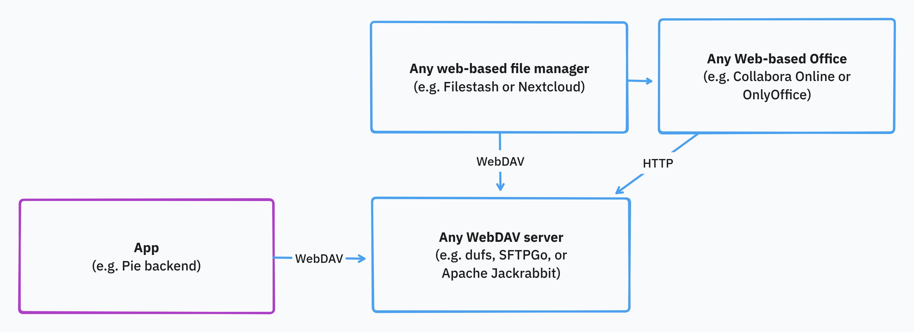
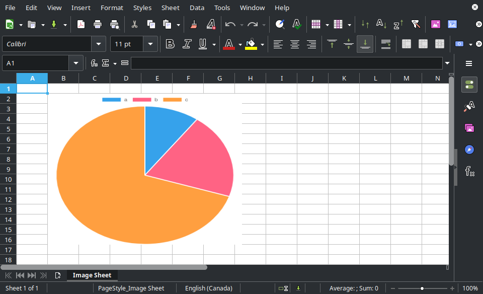

# Debugging data pipelines: From memory to file with WebDAV

Saving and viewing ephemeral intermediate files or file-like data artifacts using WebDAV and Filestash. For a better DX.

I've always wondered what the hell was the deal with [Apache Jackrabbit][apache-jackrabbit], WebDAV, CalDAV, etc.

Now, they are starting to make sense.

Apache Jackrabbit is a low-level content repository—think of it as the storage layer behind a headless CMS^[not-cms]. It also supports WebDAV, which is what first got me interested.
I liked the idea of using it for its advanced features—node graphs, querying, tagging—but I couldn’t get it running locally.
And honestly, I was overkill. A simple WebDAV server would do, so I tried a few and settled on `dufs`. It’s good enough for now. I might revisit Jackrabbit later if the extra features become useful.

[^not-cms]:  It's not a CMS itself, but you can build one on top of it. Adobe Experience Manager does this, exposing content via a RESTful API.
  * See [AEM Screens – REST API][aem-rest-apis]
  * It follows the [Siren specification][siren].


## Idea

Treat WebDAV as a "poor man's Google Drive" for debugging pipelines, allowing in-memory artifacts to be exported and browsed via Filestash.

### Background

Suppose you are working on a complex data-heavy system, like a business intelligence platform called Pie.

You need to debug its internal data processing pipelines--how data changes from stage to stage, from start to finish.
The QA team might benefit from checking some specific pieces of information that are otherwise hard to validate end-to-end.
Your PM might ask you to just send them the actual Excel file and formulas being used, so you have to generate a file[^maybe-file-like], copy it, and email it. This might happen more than once as business requirements and implementation change.

[^maybe-file-like]: There might be no file or even file-like thing. You may be working with data frames (Pandas or [Polars][polars]) or event streams or whatnot.

[polars]: https://github.com/pola-rs/polars

You see, that was a common pain point. Poor DX.

The **ideal approach** would be to automatically export the in-memory data as a file, and upload it to Google Drive, making it easy to open on Google Sheets, for example.

Up until recently, my **crude approach** was to write data as `.tsv` in a local folder when running on my machine. I would open it using LibreOffice Calc or import it into Google Sheets since they support tsv.

I don't remember how I came across Filestash, but once I read it supports WebDAV, I immediately remembered Apache Jackrabbit. I thought, "Why not link the two?"

And so I came up with a more **streamlined approach**: Save data as Excel to a WebDAV server (Apache Jackrabbit or probably a simpler more dedicated server), and open it in Filestash.
Filestash is a web client that supports WebDAV and previews Excel files.
Both the server and client can be dockerized, so we can use them during local or remote dev.

WebDAV gives you a filesystem abstraction over HTTP, which nicely glues everything together:

> 
> Main components and used protocols

Possible wins:

- Simplifies debugging.

- Better transparency and observability.

- We can log the saved file's URL using any existing logging infrastructure (e.g. OpenObserve or Datadog).


### Technicalities

**Why WebDAV?**
WebDAV is an HTTP-based **_standard_** with broad support across OS file managers (e.g., Windows Explorer or [Mac's thing][m]). It's simple to integrate, future-proof enough, and has many server implementations: Jackrabbit, Apache Server, and various standalone options.

Possible alternatives:
- [ ] MinIO (S3-compatible local storage).
- [ ] FTP (FTPS or SFTP).

**Why Filestash?**
Filestash adds a clean web UI to your WebDAV server—think: a minimalist, local Google Drive. Dockerizing both gives you disposable, reproducible environments for dev/debugging.

Try [their demo][filestash-demo] (Documents > Office.xlsx).

Pros: Simple, user-friendly interface.

Cons: No descending sort support.


Possible alternatives:

- [ ] [Nextcloud](https://nextcloud.com/)
  * It uses either Collabora Online or OnlyOffice.
  * Seems to be trying to do too much, but it's popular.


### Challenges and possible questions

- File name conflicts.
Easily solvable: Each operation or job should use a unique prefix or folder. This should be a "Correlation ID" if it exists.
Otherwise, a random (preferably sortable) key would do, something like [Snowflake ID][snowflake-id] or [UUID v7][uuid-v7].

- Data retention policy. When and how to delete old files/folders?
Apache Jackrabbit supports querying nodes and lets us specify custom metadata (e.g. "neverExpires" or "expiresOn" or whatever). That simplifies data manipulation.
Still, we could use simple deletion logic (e.g. older than 3 days) via a `cron` job.

- How to send data to the server?
Options:
  * [x] Install a WebDAV client (I mean, what's a new JS dependency).
  * [ ] Use a WebDAV server that has a RESTful API: [SFTPGo][sftpgo], for example.

- What about performance?
  * Each job generates only a couple of files.
  * Overhead does not matter since we only use it for debugging locally. We might enable it in dev, but obviously not prod.
  * Network overhead does not matter since the app backend and WebDAV servers are on the same "machine".


## Experiment

### Scenario: Analytics Platform

Imagine you are developing an analytics platform called Pie.

This is how it works:

- Get labels and their associated values from the request.

- Generate a pie chart image (in-memory).

- Generate an Excel file with that chart (in-memory).

- Send that file as a response.

Example:
http://127.0.0.1:3000/pie?a=10&b=20&c=70

It would generate an Excel file containing a pie chart:


### WebDAV Server

Using [`dufs`][dufs]
```sh
dufs --auth admin:admin@/:rw --allow-all
```

### Client

Using [`webdav`][npm-webdav]:
```js
import { createClient } from "webdav";

const client = createClient("http://192.168.100.11:5000/", { username: "admin", password: "admin" });

await client.putFileContents("/omega/deep/test.txt", "some text");
```

List files:
```js
const directoryItems = await client.getDirectoryContents("/");
console.table(directoryItems);
```

### Filestash

See [Filestash install guide](https://www.filestash.app/docs/install-and-upgrade/).

Basically, just use Docker Compose to setup Filestash and Collabora Online and link them together.

I modified the `docker-compose.yml` file to also setup `dufs` as our WebDAV server.

How to run locally:
```sh
cd filestash

# Sets up dufs WebDAV server, Filestash, and Collabora Online
sudo docker compose up -d

sudo docker compose down
```

(The docker-compose thing does not follow best practices and can be greatly improved.
I am not a DevOps engineer and even can can realize that.)


## Conclusion

It works.

However, it needs more refinement:
Mainly the data cleanup mechanisms.
Following DevOps best practices.

---

Check the "Experiment" repo (WebDAV server and pie app): https://github.com/djalilhebal/debugging-data-pipelines-demo

---

END.

<!-- LINK DEFS -->

[snowflake-id]: https://en.wikipedia.org/wiki/Snowflake_ID
[uuid-v7]: https://en.wikipedia.org/wiki/Universally_unique_identifier#Version_7_(timestamp_and_random)

[siren]: https://github.com/kevinswiber/siren

[aem-rest-apis]: https://experienceleague.adobe.com/en/docs/experience-manager-cloud-service/content/screens-as-cloud-service/developing-screens-cloud/rest-apis-screens-cloud "REST APIs | Adobe Experience Manager"

[apache-jackrabbit]: https://jackrabbit.apache.org/
[dufs]: https://github.com/sigoden/dufs
[sftpgo]: https://github.com/drakkan/sftpgo

[npm-webdav]: https://github.com/perry-mitchell/webdav-client
[mac-webdav]: https://support.apple.com/en-gb/guide/mac-help/mchlp1546/mac "Connect to or disconnect from a WebDAV server on Mac – Apple Support (UK)"

[filestash-demo]: https://demo.filestash.app/login?type=webdav&url=https%3A%2F%2Fwebdav.filestash.app&username=&password=
