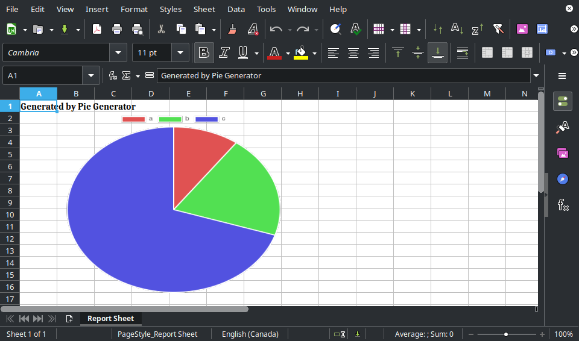

# Debugging Data Pipelines: From Memory to File with WebDAV

Debugging complex data pipelines often involves keeping track of short-lived data--things like Excel buffers, normalized inputs, chart images, and transformed data frames. \
You could log some JSON and start guessing: "Was it the parser in the transform step with the off-by-one error?" But what if you could... just open it in a UI?

This post outlines a setup that turns transient data into inspectable artifacts, with almost zero friction, improving (my) the developer experience dramatically.


## The Problem: Poor Debugging Experience

Suppose you are working on a complex data-heavy system, like a business intelligence platform called Pie.

You need to debug its internal data processing pipelines--how data changes from stage to stage, from start to finish.

The QA team might benefit from checking some specific pieces of information that are otherwise hard to validate end-to-end. Your PM might ask you to send them the actual Excel file and formulas being used, so you have to generate a file\*, copy it, and email it. This might happen more than once as business requirements and implementation change.

This becomes a recurring pain point with poor developer experience.

(\* There might be no file or even file-like thing. You may be working with data frames (Pandas or [Polars][polars]), event streams, and whatnot.)


## The Solution: A Poor Man's Google Drive for Debug Data

### The Concept

The **ideal approach** would be to automatically export the in-memory data as a file and upload it to Google Drive, making it easy to open on Google Sheets, for example.

Up until recently, my **crude approach** was to write data as `.tsv` in a local folder when running on my machine. I would open it using LibreOffice Calc or import it into Google Sheets since they support `.tsv`.

After going down one too many rabbit holes--and nearly building a content repository just to debug Excel files--I stumbled onto a simpler, more **streamlined approach**:

**Treat in-memory data as a file, upload it to a WebDAV server, and inspect with Filestash.**

### The Architecture

> 
> Main components and protocols

This setup combines the following core technologies:

1. **WebDAV Server**: Stores debug data files
2. **Filestash**: Provides a web UI to browse files (think: minimalist Google Drive)
3. **Collabora Online**: Embedded in Filestash to preview office files (think: web LibreOffice)

### Why WebDAV?

WebDAV is an HTTP-based **_standard_** with broad support across OS file managers (e.g., Windows Explorer or [Mac's thing][mac-webdav]). It's simple to integrate[^filestash-webdav-plugin], future-proof enough, and has many server implementations: Jackrabbit, Apache Server, and various standalone options.

I've always wondered what the hell was the deal with [Apache Jackrabbit][apache-jackrabbit], WebDAV, CalDAV, etc. Now, they are starting to make sense.

Apache Jackrabbit is a low-level content repository—think of it as a headless CMS[^not-cms] that also supports WebDAV. I liked the idea of using it for its advanced features—node graphs, querying, tagging—but I couldn't get it running locally. And honestly, it was overkill. A simple WebDAV server would do, so I tried a few and settled on `dufs`. It's good enough for now. I might revisit Jackrabbit later if the extra features become useful.

[^not-cms]:  It's not a CMS itself, but you can build one on top of it. Adobe Experience Manager does this, exposing content via a RESTful API.
See [AEM Screens – REST API][aem-rest-apis]

**Possible alternatives:**

- [ ] MinIO (S3-compatible local storage).
  * I've tested MinIO. See `/debug-drive-minio` in the GitHub repo.

- [ ] FTP (FTPS or SFTP).

[^filestash-webdav-plugin]: WebDAV is so simple that you can create a client using any HTTP client.
Like, just check [Filestash's WebDAV adapter](https://github.com/mickael-kerjean/filestash/blob/2c09815c4e5f6bd681a3a5cf88b24774848f2da5/server/plugin/plg_backend_webdav/index.go)

### Why Filestash?

Searched "webdav" on GitHub, sorted by stars, and skimmed the top results. Filestash stood out. The missing piece I didn't know I needed—until I did.

Filestash serves a clean web UI to our storage backend—think: a minimalist, local Google Drive. It uses Collabora Online (think: web LibreOffice) to preview office files.

Try [their demo][filestash-demo] (Documents > Office.xlsx).

Pros:

- Clean and user-friendly interface.

- The storage server (e.g. WebDAV or S3) needs to be accessible only to the backend server and Filestash server.
Meaning, that only Filestash needs to be exposed to the internet.

Cons:

- No descending sort support.

- LibreOffice Calc (and the web version) handles `.csv` and `.tsv` just fine, but Filestash opens them in a basic text viewer.
As far as I can tell, there's no UI option to change the default viewer or editor per file type.
You'd probably need to dive into plugin code (written in Go) and recompile it to get that working.

  * Workaround: Just convert the `.tsv` to a proper Excel file.

**Possible alternatives:**

- [ ] [Nextcloud](https://nextcloud.com/)
  * It uses either Collabora Online or OnlyOffice.
  * Seems to be trying to do too much, but it's popular.


## Implementation: Step by Step

To demonstrate the approach, I built a simplified proof-of-concept.

### Scenario: Analytics Platform

Imagine you are developing an analytics platform called Pie.

**Operation:** Generate Excel files with pie charts from query parameters.

**Steps:**

- Get labels and their associated values from the request.
- Generate a pie chart image (in-memory).
- Generate an Excel file with that chart (in-memory).
- Send that file as a response.

Example:
- Local version (run `pie-generator-backend`): http://127.0.0.1:3000/pie?a=10&b=20&c=70
- Live version (deployed on Vercel): https://debugging-data-pipelines-demo.vercel.app/pie?a=10&b=20&c=70

It would generate an Excel file containing a pie chart:


### Setting Up the WebDAV Server

Using [`dufs`][dufs]:
```sh
dufs --auth admin:admin@/:rw --allow-all
```

### Writing Code for the Client

Using [`webdav`][npm-webdav]:
```js
import { createClient } from "webdav";

const client = createClient("http://192.168.100.11:5000/", { username: "admin", password: "admin" });

await client.putFileContents("/omega/deep/test.txt", "some text");
```

### Setting Up Filestash

See [Filestash install guide](https://www.filestash.app/docs/install-and-upgrade/).

Basically, just use Docker Compose to set up Filestash and Collabora Online and link them together.

### Making it Reusable

Instead of wiring the WebDAV logic directly into each task, I abstracted it into a helper:
```ts
async function saveToWebdav(filename: string, data: Buffer | string) {
  const client = createClient(WEB_DAV_URL, { username, password });
  await client.putFileContents(filename, data);
}
```

Everything runs in Docker, so setup -- whether local or remote -- is painless.
I added `dufs` to Filestash's `docker-compose.yml``[^docker-disclaimer], so everything starts together with a single command:

```sh
cd debug-drive

# Sets up dufs WebDAV server, Filestash, and Collabora Online
sudo docker compose up -d

sudo docker compose down
```

[^docker-disclaimer]: The Docker Compose thing doesn't follow best practices and could be polished. I am not a DevOps engineer and even I can realize that.


## Results

| Login | Browsing logs | Previewing Excel
|:-----:|:-------------:|:------------------:
|  |  | 

### Big Wins

- Simplifies debugging.

- Better transparency and observability.

- We can log the saved file's URL using any existing logging infrastructure (e.g. Datadog, Sentry, or OpenObserve).

### Challenges and Considerations

- **File name conflicts**:
  Easily solvable: Each operation or job should use a unique prefix or folder. This should be a "Correlation ID" if it exists.
  Otherwise, a random (preferably sortable) key would do, something like [Snowflake ID][snowflake-id] or [UUID v7][uuid-v7].

- **Data retention policy**:
  When and how to delete old files/folders?
  Apache Jackrabbit supports querying nodes and lets us specify custom metadata (e.g. "neverExpires" or "expiresOn" or whatever). That simplifies data manipulation.
  Still, we could use simple deletion logic (e.g. older than 3 days) via a `cron` job.

- **How to send data to the server**:
  Options:
    * [x] Install a WebDAV client (I mean, what's a new JS dependency).
    * [ ] Use a WebDAV server that has a RESTful API: [SFTPGo][sftpgo], for example.
    * [ ] Use S3/MinIO. It works best if we only need a REST API. 

- **Performance considerations**:
    * Each task generates only a couple of files.
    * Overhead does not matter since we only use it for debugging locally. We might enable it in dev, but obviously not prod.
    * Network overhead does not matter since the app backend and WebDAV servers are on the same "machine".


## Conclusion

WebDAV + Filestash makes for a surprisingly elegant debugging solution for data-heavy applications.

As always, there's room for improvement:
- We need proper data retention and cleanup mechanisms.
- The Docker setup could use some DevOps care.
- Access control should be tightened (Filestash only needs read access).

---

The experiment repo is available at https://github.com/djalilhebal/debugging-data-pipelines-demo

---

END.

<!-- LINK DEFS -->

[snowflake-id]: https://en.wikipedia.org/wiki/Snowflake_ID
[uuid-v7]: https://en.wikipedia.org/wiki/Universally_unique_identifier#Version_7_(timestamp_and_random)

[aem-rest-apis]: https://experienceleague.adobe.com/en/docs/experience-manager-cloud-service/content/screens-as-cloud-service/developing-screens-cloud/rest-apis-screens-cloud "REST APIs | Adobe Experience Manager"

[polars]: https://github.com/pola-rs/polars

[apache-jackrabbit]: https://jackrabbit.apache.org/
[dufs]: https://github.com/sigoden/dufs
[sftpgo]: https://github.com/drakkan/sftpgo
[npm-webdav]: https://github.com/perry-mitchell/webdav-client
[mac-webdav]: https://support.apple.com/en-gb/guide/mac-help/mchlp1546/mac "Connect to or disconnect from a WebDAV server on Mac – Apple Support (UK)"

[filestash-demo]: https://demo.filestash.app/login?type=webdav&url=https%3A%2F%2Fwebdav.filestash.app&username=&password=
